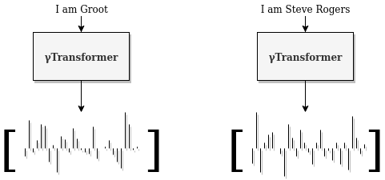

# s2v_gammaTransformer
This is implementation of Gated Modified Multihead Attention Transformer used for compressing sentences to fix lenght vectors.

# Model
γTransformer consists of two layers:
- Modified transformer encoder - replacing residual connections with gating mechanism and a modified version of the MHA sublayer,
- Pooling layer - preprocessing the words using Mulithead Attention and using max pool to down sample the words representation.

The model uses ROBERT'a embedings as an input and outputs 4096d sentence vector.

# Results

